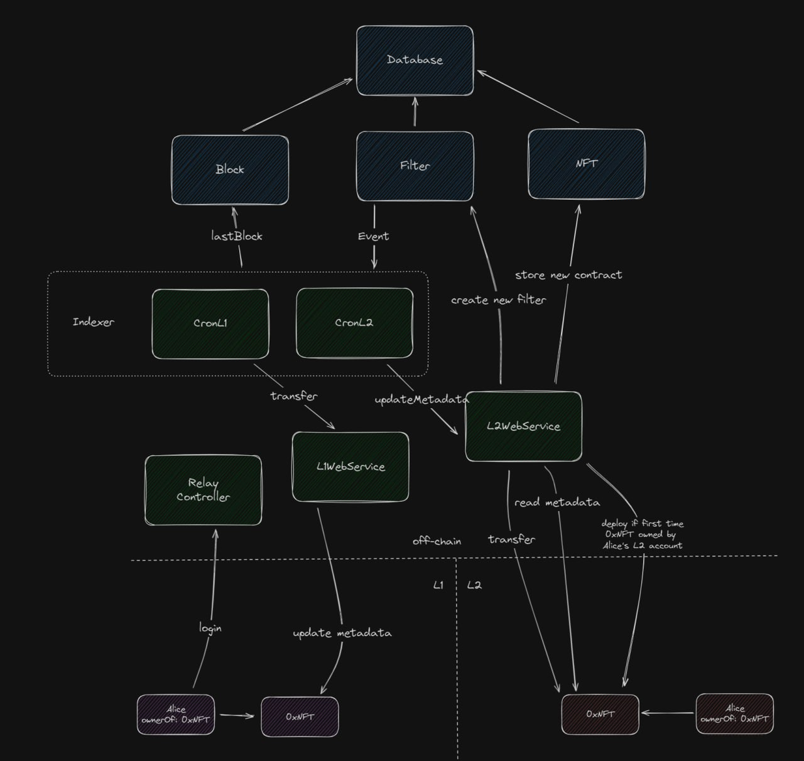

# Miral

A relayer able to mirror any NFT to an arbitrary L2

## How to use it

- Launch MongoDB using docker compose

```
docker compose up
```

- Launch relayer

```
yarn start
```

And that's pretty much it

## How to interact

- Deploy

```
curl -X POST -H "Content-Type: application/json" -d '{"constructorArgs":["arg1", "arg2"]}' http://localhost:3000/deploy/--l1ContractAddress--
```

- Login

```
http://localhost:3000/login/--L1 EOA--/--L1 NFT ADDRESS--/--Token Id--
```

- Update L1

```
http://localhost:3000/login/--l2ContractAddress--/--tokenId--
```

## Architecture
<p align="center">
  
</p>
